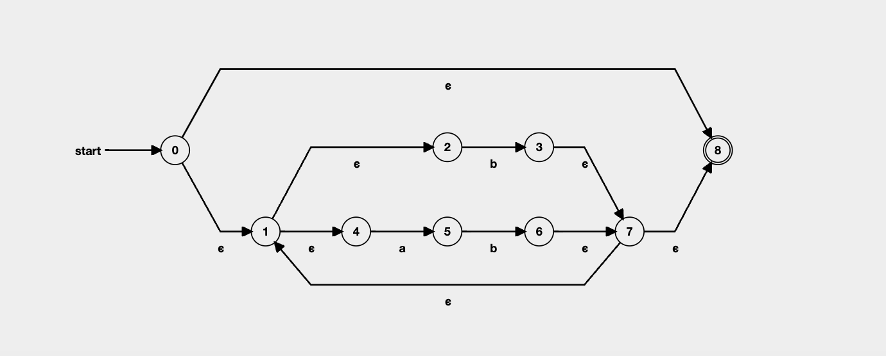

# Assignment 2

All non-code answers are in this file.

</br>

---

## PLC 2.4

All answers to this exercise can be found in `ex2_4.fs`.

## PLC 2.5

Has already been done and simply just compile provided `Machine.java` and run:
```% javac Machine.java```
```% java Machine is1.txt```

</br>

## PLC 3.2

Write a regular expression that recognises all sequences consisting of *a* and *b* where two *a*'s are always seperated by at least one *b*.
For instance, these four strings are legal: *b*, *a*, *ba*, *ababbbaba*; but these two strings are illegal: *aa*, *babaa*.

**Answer:**

```regex
(b|ab)*
```

`b*` a single *b*.
`ab` an *a* will always be followed by a *b*, ensuring that no two *a*'s will ever be followed by each other.
`(b|ab)*` repeats any sequence of `b` or `ab`.

Construct the corresponding NFA. Try to find a DFA corresponding to the NFA.

**NFA:**



**DFA:**


| DFA state | move(a) | move(b) | NFA states               |
|-----------|---------|---------|--------------------------|
| `*A*`     |  `B`    |   `C`   | `{ 0, 1, 2, 4, *8* }`    |
| `*B*`     |  `{}`   |   `D`   | `{ 5 }`                  |
| `*C*`     |  `B`    |   `C`   | `{ 1, 2, 3, 4, 7, *8* }` |
| `*D*`     |  `B`    |   `C`   | `{ 1, 2, 4, 6, 7, *8* }` |

</br>

## HelloLex Question 1

Read the specification `hello.fsl`.
What are the regular expressions involved, and which semantic values are they associated with?

**Answer:**
The regular expressions invovled are: `['0'-'9']`.
The semantic value is a single digit number between 0-9.

</br>

## HelloLex Question 2

Generate the lexer out of the specification using a command prompt.
Which additional file is generated during the process?

**Answer:**
`hello.fs`

How many states are there by the automation of the lexer?

**Answer:**
3 states.


</br>

## HelloLex Question 3

Compile and run the generated program `hello.fs`from question 2.

**Answer:**
To run the program you must follow these steps:

``` fsharppc
% dotnet build HelloLex/hello1/hello.fsproj

% dotnet HelloLex/hello1/bin/Debug/net8.0/hello.dll
```

Outcome should be:

``` fsharppc
Hello World from FsLex!

Please pass a digit:
34
The lexer recognizes 3
%
```

</br>

## HelloLex Question 4

Extend the lexer specification `hello.fsl`to recognise numbers of more than one digit.
New lexer specification is `hello2.fsl`.
Generate `hello2.fs`, compile and run the generated program.

**Answer:**

```fsharppc
% dotnet fslex.dll --unicode ../../Assignment2/HelloLex/hello2/hello2.fsl
compiling to dfas (can take a while...)
4 states
writing output
%
```

To run the program you must follow these steps:

``` fsharppc
% dotnet build HelloLex/hello2/hello2.fsproj

% dotnet HelloLex/hello2/bin/Debug/net8.0/hello2.dll
```

Outcome should be:

``` fsharppc
Hello World from FsLex!

Please pass a digit:
234
The lexer recognizes 234
%
```

</br>

## HelloLex Question 5

Extend the lexer specification `hello2.fsl`to recognise numbers of more than one digit.
New lexer specification is `hello3.fsl`.
Generate `hello3.fs`, compile and run the generated program.

Hint: You can use the regular expression `[+-]?([0-9]*[.])?[0-9]+` to recognize floats.

**Answer:**

```fsharppc
% dotnet fslex.dll --unicode ../../Assignment2/HelloLex/hello3/hello3.fsl
compiling to dfas (can take a while...)
10 states
writing output
%
```

To run the program you must follow these steps:

``` fsharppc
% dotnet build HelloLex/hello3/hello3.fsproj

% dotnet HelloLex/hello3/bin/Debug/net8.0/hello3.dll
```

Outcome should be:

``` fsharppc
Hello World from FsLex!

Please pass a digit:
34.34
The lexer recognizes 34.34
%
```

</br>

## HelloLex Question 6

Consider the 3 examples of input provided at the prompt and the result.

```fsharppc
% dotnet bin/Debug/net8.0/hello3.dll
Hello World from FSLex!

Please pass a digit:
34
The lexer recognises 34

% dotnet bin/Debug/net8.0/hello3.dll
Hello World from FsLex!

Please pass a digit:
34.24
The lexer recognises 34.24

% dotnet bin/Debug/net8.0/hello3.dll
Hello World from FsLex!

Please pass a digit:
34,34
The lexer recognises 34
%
```

Explain why the results are expected behaviour from the lexer.

**Answer:**

The lexer recognises the expected behaviour according to how it's token recognition rules.

The first recognises that `34` is a valid integer, therefore outputting `34`.

The second recognises that `34.24` is a floating-point number, therefore outputting `34.24`.

The third recognises that `34,34` uses a comma `,` and not a period `.`, therefore stops processing after `34` and outputting only `34`.

</b>

---
