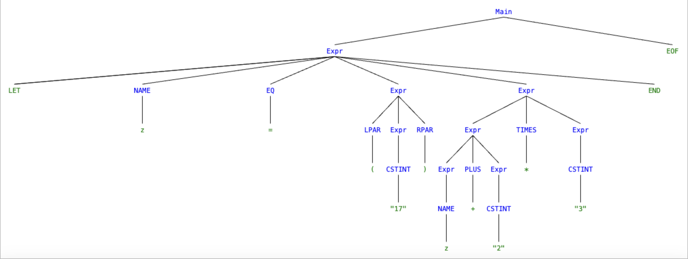

# Assignment 3

All non-code answers are in this file.

</br>

---

## PLC 3.3

Write out the rightmost derivation of the string below from the expression grammar at the end of Sect. 3.6.5, corresponding to `ExprPar.fsy`.

Take note of the sequence of grammer rules (A-I) used:

``` fsharppc
Main ::= Expr EOF                         rule A
Expr ::= NAME                             rule B
      |  CSTINT                           rule C
      |  MINUS CSTINT                     rule D
      |  LPAR Expr RPAR                   rule E
      |  LET NAME EQ Expr IN Expr END     rule F
      |  Expr TIMES Expr                  rule G
      |  Expr PLUS  Expr                  rule H
      |  Expr MINUS Expr                  rule I
```

String:

```let z = (17) in z + 2 * 3 end EOF```

**Answer:**

> $\text{Main}$
>
> $\overset{A}\rightarrow \text{\textbf{\textit{Expr} EOF}}$
>
> $\overset{F}\rightarrow \text{\textbf{LET NAME EQ \textit{Expr} IN \textit{Expr} END EOF}}$
>
> $\overset{G}\rightarrow \text{\textbf{LET NAME EQ \textit{Expr} IN \textit{Expr} TIMES \textit{Expr} END EOF}}$
>
> $\overset{G}\rightarrow \text{\textbf{LET NAME EQ \textit{Expr} IN \textit{Expr} * \textit{Expr} END EOF}}$
>
> $\overset{C}\rightarrow \text{\textbf{LET NAME EQ \textit{Expr} IN \textit{Expr} * CSTINT END EOF}}$
>
> $\overset{C}\rightarrow \text{\textbf{LET NAME EQ \textit{Expr} IN \textit{Expr} * 3 END EOF}}$
>
> $\overset{H}\rightarrow \text{\textbf{LET NAME EQ \textit{Expr} IN \textit{Expr} PLUS \textit{Expr} * 3 END EOF}}$
>
> $\overset{H}\rightarrow \text{\textbf{LET NAME EQ \textit{Expr} IN \textit{Expr} + \textit{Expr} * 3 END EOF}}$
>
> $\overset{C}\rightarrow \text{\textbf{LET NAME EQ \textit{Expr} IN \textit{Expr} + CSTINT * 3 END EOF}}$
>
> $\overset{C}\rightarrow \text{\textbf{LET NAME EQ \textit{Expr} IN \textit{Expr} + 2 * 3 END EOF}}$
>
> $\overset{B}\rightarrow \text{\textbf{LET NAME EQ \textit{Expr} IN NAME + 2 * 3 END EOF}}$
>
> $\overset{B}\rightarrow \text{\textbf{LET NAME EQ \textit{Expr} IN z + 2 * 3 END EOF}}$
>
> $\overset{E}\rightarrow \text{\textbf{LET NAME EQ LPAR \textit{Expr} RPAR IN z + 2 * 3 END EOF}}$
>
> $\overset{E}\rightarrow \text{\textbf{LET NAME EQ ( \textit{Expr} ) IN z + 2 * 3 END EOF}}$
>
> $\overset{C}\rightarrow \text{\textbf{LET NAME EQ ( CSTINT ) IN z + 2 * 3 END EOF}}$
>
> $\overset{C}\rightarrow \text{\textbf{LET NAME EQ ( 17 ) IN z + 2 * 3 END EOF}}$
>
> $\overset{B}\rightarrow \text{\textbf{LET z EQ ( 17 ) IN z + 2 * 3 END EOF}}$
>
> $\text{\textbf{LET z = ( 17 ) IN z + 2 * 3 END EOF}}$

## PLC 3.4

Draw the above derivation as a tree.

**Answer:**

[//]: < [Main [Expr [LET][NAME [z]][EQ [=]][Expr [LPAR [(]] [Expr[CSTINT ["17"]]] [RPAR[)]]] [IN] [Expr [Expr[Expr [NAME [z]]] [PLUS[+]] [Expr [CSTINT ["2"]]]] [TIMES [*]] [Expr [CSTINT ["3"]]]][END]][EOF]] (Drawing of tree line in generator)>



## PLC 3.5

Generate the lexer and parser for expressions by running `fslex` and `fsyacc`; then load the expression abstract syntax, the lexer and the parser modules, and the expression interpreter and compilers into an interactive F# session(`fsharpi`):

```fsharppc
dotnet fslex --unicode ExprLex.fsl
dotnet fsyacc --module ExprPar ExprPar.fsy
dotnet fsi -r FsLexYacc.Runtime.dll Absyn.fs ExprPar.fs ExprLex.fs Parse.fs
```

Try the parser on several example expressions, both well-formed and ill-formed ones:

```fsharppc
open Parse;;
  fromString "1 + 2 * 3";;
  fromString "1 - 2 - 3";;
  fromString "1 + -2";;
  fromString "x++";;
  fromString "1 + 1.2";;
  fromString "1 + ";;
  fromString "let z = (17) in z + 2 * 3 end";;
  fromString "let z = 17) in z + 2 * 3 end";;
  fromString "let in = (17) in z + 2 * 3 end";;
  fromString "1 + let x=5 in let y=7+x in y+y end + x end";;
```

**Running and observing:**

[//]: <dotnet fsi -r FsLexYacc.Runtime.dll ../BPRD-03-OKRE-PEKP/Assignment3/Expr/Absyn.fs ../BPRD-03-OKRE-PEKP/Assignment3/Expr/ExprPar.fs ../BPRD-03-OKRE-PEKP/Assignment3/Expr/ExprLex.fs ../BPRD-03-OKRE-PEKP/Assignment3/Expr/Parse.fs (How to run on Oline's computer)>

```fsharppc
open Parse;;
  fromString "1 + 2 * 3";;
    val it: Absyn.expr = Prim ("+", CstI 1, Prim ("*", CstI 2, CstI 3))

  fromString "1 - 2 - 3";;
    val it: Absyn.expr = Prim ("-", Prim ("-", CstI 1, CstI 2), CstI 3)

  fromString "1 + -2";;
    val it: Absyn.expr = Prim ("+", CstI 1, CstI -2)

  fromString "x++";;
    System.Exception: parse error near line 1, column 3

  fromString "1 + 1.2";;
    System.Exception: Lexer error: illegal symbol near line 1, column 6

  fromString "1 + ";;
    System.Exception: parse error near line 1, column 4

  fromString "let z = (17) in z + 2 * 3 end";;
    val it: Absyn.expr = 
        Let ("z", CstI 17, Prim ("+", Var "z", Prim ("*", CstI 2, CstI 3)))

  fromString "let z = 17) in z + 2 * 3 end";;
    System.Exception: parse error near line 1, column 11

  fromString "let in = (17) in z + 2 * 3 end";;
    System.Exception: parse error near line 1, column 6

  fromString "1 + let x=5 in let y=7+x in y+y end + x end";;
    val it: Absyn.expr =
        Prim
            ("+", CstI 1,
            Let
            ("x", CstI 5,
                Prim
                ("+",
                Let
                    ("y", Prim ("+", CstI 7, Var "x"), Prim ("+", Var "y", Var "y")),
                Var "x")))
```

## PLC 3.6

Use the expression parser from `Parse.fs` and the compiler scomp (from expressions to stack machine instructions) and the associated datatypes from `Expr.fs`, to define a function `compString : string -> sinstr list` that parses a string as an expression and compiles it to stack machine code.

**Answer:**

See the bottom of `Expr.fs` file.

## PLC 3.7

Extend the expression language abstract syntax and the lexer and parser specifications with conditional expressions. The abstract syntax should be `If(e1, e2, e3)`, so modify file `Absyn.fs` as well as `ExprLex.fsl` and file `ExprPar.fsy`.

The concrete syntax may be the keyword-laden F#/ML-style:

```fsharppc
if e1 then e2 else e3
```

or the more light-weight C/C++/Java/C#-style:

```fsharppc
e1 ? e2 : e3
```

**Answer:**

See files `Absyn.fs`, `ExprLex.fsl`, and `ExprPar.fsy` for answers.

</b>

---
